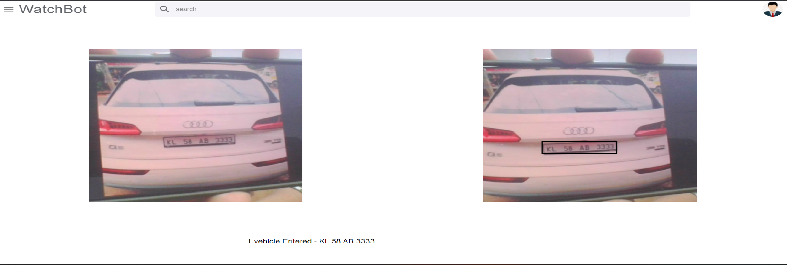

# WatchBot

## Steps to deploy code

### Front-end setup
```shell
npm i
cd frontend
npm i
npm start
```
### Back-end setup
```shell
cd backend
npm i
npm run dev
```
### Ai-model server setup
```shell
cd ai
pip install -r requirements.txt
cd watchbot
python manage.py runserver
```


### Run detector - visit url: http://localhost:3000/premise

### Demo
